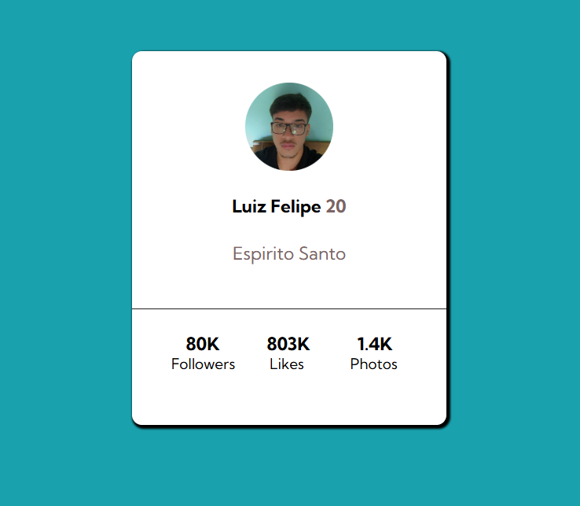

# 🚀 Profile Card - Um Cartão de Perfil Moderno e Elegante

Bem-vindo ao **Profile Card**! 🎉 Um projeto simples e elegante criado com **HTML5** e **CSS3** para exibir um perfil de forma minimalista e responsiva. Perfeito para quem quer praticar estilização e estruturação web! 💻✨
#### ✅ Link do projeto: https://luizf-devdias.github.io/exercicio-profile-card/

## 🎯 Objetivo

Este projeto tem como objetivo apresentar um cartão de perfil moderno com informações essenciais do usuário, como:

✅ Foto de perfil 📸  
✅ Nome e idade 👤  
✅ Localização 📍  
✅ Estatísticas sociais (Seguidores, Curtidas e Fotos) 📊

## 🎨 Tecnologias Utilizadas

- 🌐 **HTML5** - Estrutura semântica e organizada
- 🎨 **CSS3** - Estilização moderna com sombras, bordas arredondadas e tipografia estilizada

## 🛠️ Como Executar

1. Clone ou baixe este repositório 📥
2. Abra o arquivo `index.html` em qualquer navegador 🌍

## 📂 Estrutura dos Arquivos

```
/
|-- index.html  # Estrutura HTML do cartão de perfil
|-- style.css   # Estilos aplicados ao cartão
|-- images/     # Pasta para armazenar imagens
```

## ✨ Recursos do Projeto

✔ Design moderno com sombras suaves e bordas arredondadas 🎨  
✔ Tipografia elegante para um visual mais sofisticado 🖋️  
✔ Layout responsivo para melhor exibição em diferentes dispositivos 📱💻

## 📸 Demonstração



## 📢 Autor

Projeto desenvolvido por **Luiz Felipe** 💡🚀

Se gostou, não esqueça de deixar um ⭐ e compartilhar! 😉


